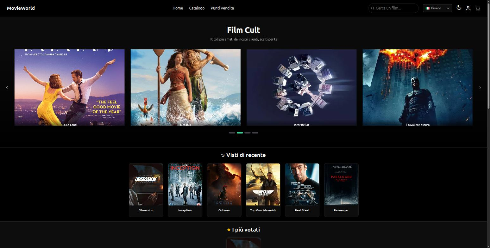
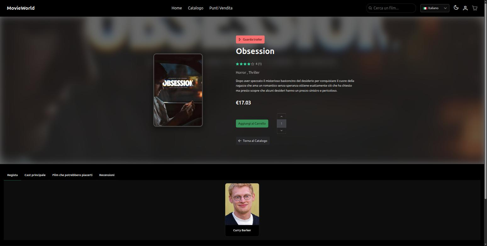
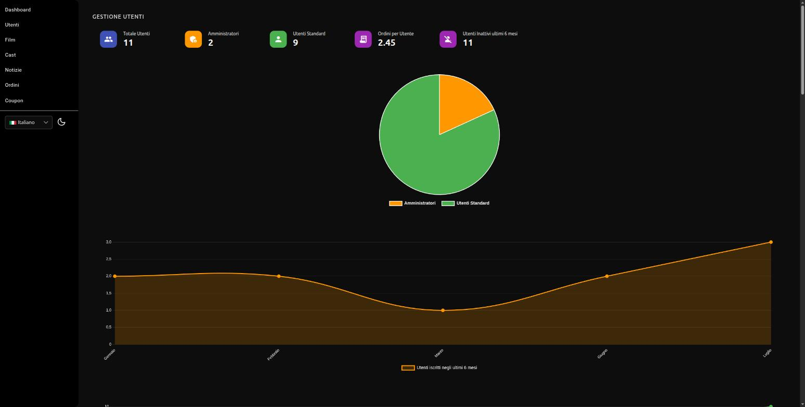

# MovieWorld


MovieWorld is a full-stack e-commerce platform for selling movies: catalog with search and advanced filters, cart, multi-store checkout, a user area with orders/reviews/wishlist, and a full admin panel.

**Live demo:** [movieworld-9msm.onrender.com](https://movieworld-9msm.onrender.com)
*(hosted on Render's free tier — the first request after a period of inactivity may take up to a minute to wake the instance up)*

## Screenshots

| Home | Movie detail | Admin dashboard |
|---|---|---|
|  |  |  |

## Tech stack

**Backend**
- ASP.NET Core 8 Web API (C#)
- Entity Framework Core 8 + SQLite
- JWT authentication
- BCrypt.Net for password hashing
- MailKit for sending email (SMTP relay, e.g. SendGrid)
- ClosedXML for Excel export

**Frontend**
- Angular 20 (standalone components, Signals)
- PrimeNG 20 + Bootstrap 5 for the public UI
- Angular Material for the admin panel
- ngx-translate for internationalization (it/en)
- Chart.js (ng2-charts) for dashboard statistics

**Deploy**
- Single Docker build: the Angular frontend is compiled and served as static files by the same Kestrel process as the API (no separate Nginx)
- `render.yaml` for deployment on Render.com

## Main features

- **Catalog**: search, filters (name, genre, year, director, actor, price), sorting (relevance, rating, price), Excel export
- **Global search bar** in the header with live results
- **Movie detail**: trailer, cast, related movies, star-rating reviews, average rating
- **Wishlist**: add/remove from the heart icon on every card, dedicated page
- **Home page**: hero carousel of cult movies, "Recently viewed" section (localStorage), "Top rated" section
- **Cart and checkout**: store selection (including by geographic distance), discount codes/coupons, order confirmation email
- **User area**: profile with editable data, password change, email password reset, order email notifications, preferred store, order history with filters, review history, auto-generated avatars
- **Notifications**: bell icon in the header with in-app notifications (+ email) whenever an admin changes an order's status
- **Admin panel**: manage users, movies, cast, news, orders, discount coupons (with usage/discount stats in the dashboard); statistics dashboard (sales, genres, users)

## Project structure

```
MovieWorld/
├── api/               .NET 8 API (Controllers, Services, Repositories, Models, Migrations)
├── api.Tests/          xUnit tests for the backend business logic
├── frontend/           Angular 20 application
├── docs/screenshots/    Screenshots used in this README
├── Dockerfile          Multi-stage build (frontend + backend in a single image)
├── docker-compose.yml
└── render.yaml          Render.com deploy configuration
```

The backend follows a layered architecture: `Controller → Service → Repository → EF Core DbContext`, with dedicated DTOs and mappers for each entity.

## Running locally

### Prerequisites
- .NET 8 SDK
- Node.js 20+
- (optional) `dotnet-ef` CLI for migrations: `dotnet tool install --global dotnet-ef`

### Backend

```bash
cd api
dotnet user-secrets set "Jwt:Key" "a-long-secret-key-of-your-choice"
dotnet run
```

The API starts on `http://localhost:5246` and uses the SQLite database already included (`api/MovieWorld.db`), pre-populated with sample data (movies, genres, cast, users, orders).

To apply any new migrations:

```bash
cd api
dotnet ef database update
```

### Frontend

```bash
cd frontend
npm install
npm start
```

The app starts on `http://localhost:4200` and points to the API at `http://localhost:5246` (see `frontend/src/app/constants/app.config.ts`).

### Sending email (optional)

Email sending (order confirmation, password reset) is disabled until an SMTP relay is configured. Example with SendGrid, in `api/appsettings.Development.json`:

```json
"Email": {
  "Host": "smtp.sendgrid.net",
  "Port": "587",
  "Username": "apikey",
  "FromAddress": "your-verified-address@example.com",
  "FromName": "MovieWorld"
}
```

The password/API key must be set separately, without committing it:

```bash
dotnet user-secrets set "Email:Password" "your-api-key"
```

If `Email:Host` is not configured, the service logs a warning and never blocks the main flow (e.g. order creation still succeeds even without email configured).

### Rate limiting

The `login`, `register`, and `forgot-password` endpoints are limited to 5 requests per minute per IP address (a shared budget across all three), to mitigate brute-force attempts. Beyond the threshold the API responds with `429 Too Many Requests`. Configured in `Program.cs`, no environment variable required.

### Tests

```bash
cd api.Tests
dotnet test
```

Covers the most delicate business logic (repositories mocked with Moq): coupon validation and discount calculation, coupon creation/activation, and notification/email generation on order status changes.

## Deploying with Docker

```bash
JWT_KEY="a-long-secret-key-of-your-choice" docker compose up --build
```

The final image contains both the .NET API and the published Angular static files, all served on the same port (`8080` by default, configurable via `PORT`).

## CI

The workflow in `.github/workflows/ci.yml` automatically runs, on every push/PR to `main`, the backend test suite (`dotnet test`) and the production frontend build (`ng build`).

## Notes

- The SQLite database is committed to the repository so demo data is always ready to use in development and on first deploy.
- EF Core migrations live in `api/Migrations`; every data model change requires a new migration (`dotnet ef migrations add MigrationName`) followed by `dotnet ef database update`.
